# RemoteProxyLink

Securely exposing home server services via a VPS using Docker, VPN tunnel, Omada, Authentik and Nginx.

## Background and requirements

This approach requires no port forwarding and avoids common pitfalls associated with services like Cloudflare Tunnels and Tailscale.

This setup is based on free-to-use services, except for Omada, which can be self-hosted but requires an Omada-compatible network switch for ACL rules and a router for VPN functionality. Alternatively, pfSense can provide similar capabilities. Additionally, a VPS must be rented, though some providers—such as Oracle—offer powerful free-tier options. Furthermore, a domain is required for proper configuration; Cloudflare offers domains at cost, along with useful additional features such as Full DNS management, DDoS protection, and IP proxying.

This is not a step-by-step tutorial, as many of the steps are only briefly explained. However, someone with intermediate knowledge of Docker, DNS, and VPS configuration should be able to fill in the gaps.

Illustrative visualization on how the connections work.
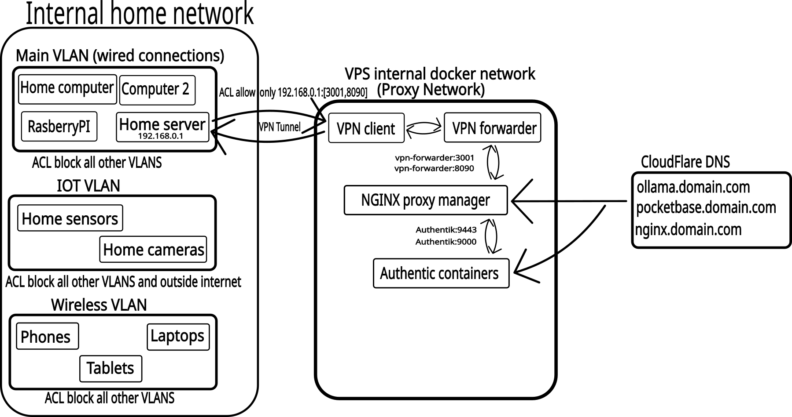

## NginxProxyManager and opening VPS ports

Nginx Proxy Manager is a web-based interface that simplifies the configuration and management of Nginx as a reverse proxy, allowing users to easily manage domains, SSL certificates, and proxy hosts.

Clone this repository or copy the folders to your VPS. Begin by navigating to the `./NginxProxyManager` directory. Run `docker compose up -d --build` inside that folder to start the service.

For secure setup, temporarily forward port 80 using SSH tunneling to safely create the admin user. Afterward, open ports 80 and 443 on your VPS. For Oracle Cloud, this can be done via:

**VPS → Virtual Cloud Networks → Security → Security Rules.**

Once configured, the Nginx Proxy Manager status page should be accessible at `http://[your-vps-ip]:80`. If it's not loading, check that the necessary ports are open and that no firewall rules inside the VPS are blocking access (e.g., check with `sudo ufw status`).

Create DNS **A** records with your DNS provider, pointing them to your VPS IP address. Then, in the SSH-tunneled web UI of Nginx Proxy Manager, create a new **Proxy Host** entry pointing to `http://[your-vps-ip]:81`.

After some time, the DNS entries should propagate, and the web UI should become accessible at your domain, e.g., `http://example.com`.

## Authentik

Authentik is a self-hosted, open source identity provider that provides us with a common middleware and authentication flow between the different services.
https://docs.goauthentik.io/docs/install-config/install/docker-compose

Navigate to the `./Authentik` directory and run `docker compose up -d --build` to start the service. Then, use an SSH tunnel on port **9443** to securely access the setup interface and create your admin user.

**Setting up the provider, outpost and auth application from the admin interface.**

Applications -> Create with Wizard.

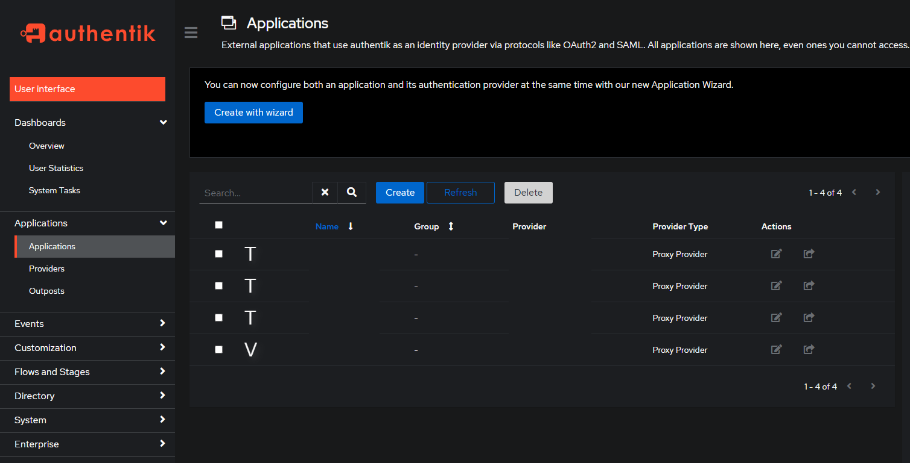

Enter a **name** and **slug** (e.g., `nginx`)

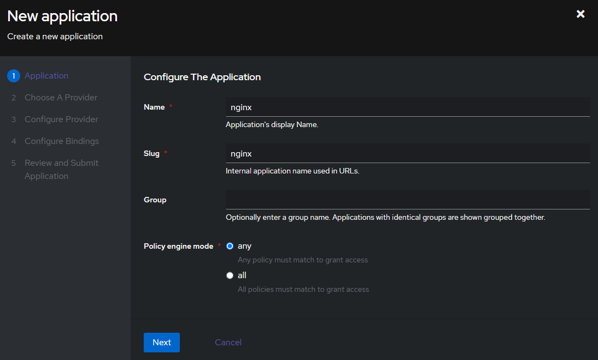

Select proxy provider.

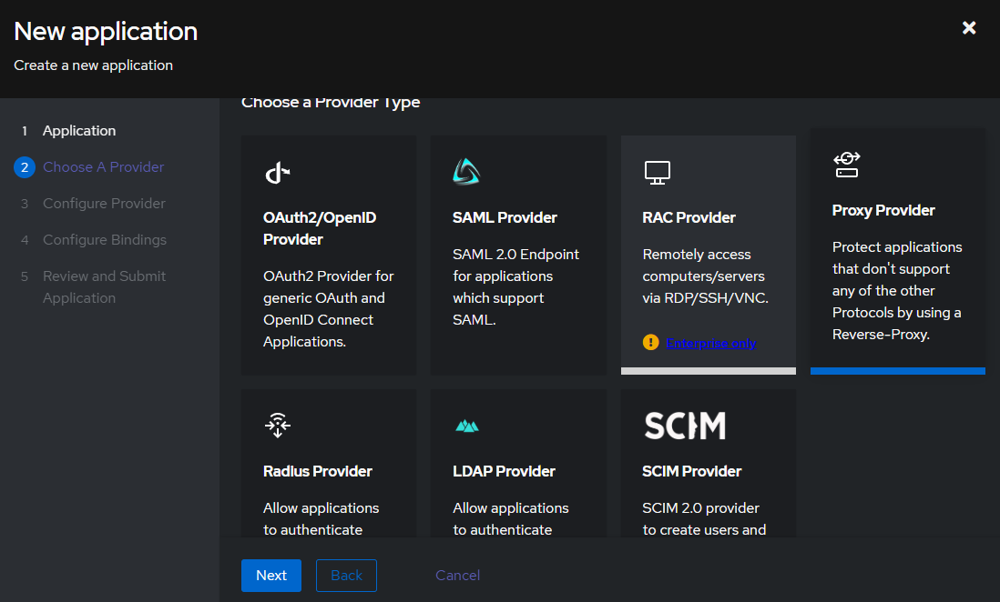

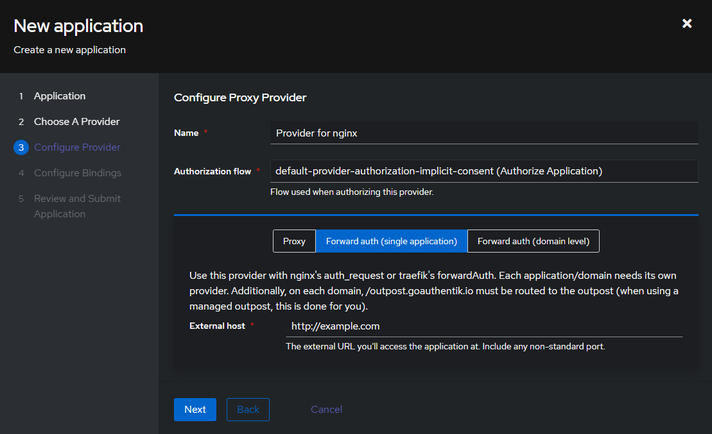

Select **Implicit Authorization** and **Single Application** . Under the "Single Application" section, enter the domain you wish to secure. For the following steps, simply press **Next** until the setup is complete. The wizard will automatically configure both the application and its authentication provider.

Next, create new **DNS A records** for Authentik (e.g., `authentik` and `authentik2`).

After which, at Nginx Proxy Manager create new proxy host.

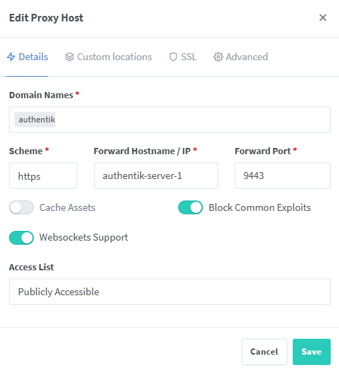

Repeat the same steps for `authentik-server-1:9000`, but with **HTTP** as the scheme. Once the setup is complete, configure **SSL** for both services. You can either use **Let’s Encrypt** or **Cloudflare** to secure the connections with SSL.

Note that `authentik-server-1` is the name of the Authentik Docker container. You can check the container name by running `docker ps`. The container uses Docker's **domain name system (DNS)** to map the domain to the correct container IP.

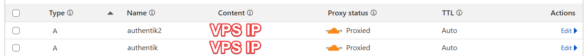

The **Proxy Hosts** should be configured like this, with `http://nginxproxymanager-npm-1:81` replaced by your VPS IP address.

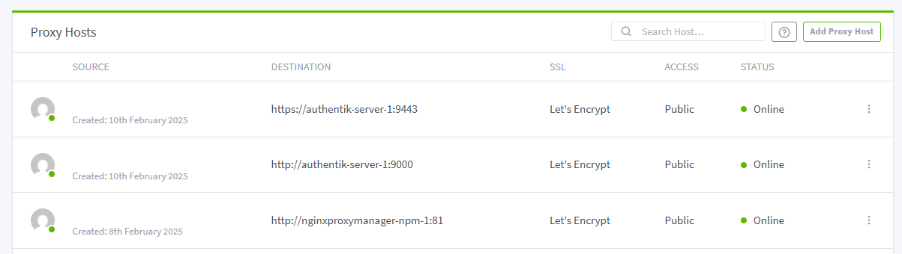

Next, create a new **Outpost** and select the application you created from the available applications. Under advanced settings change **authentik_host**:

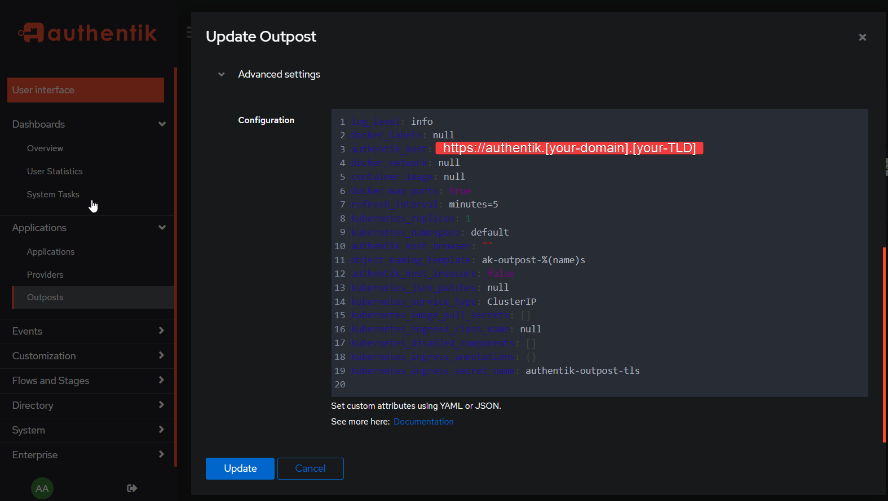

And finally create the outpost.

Under **Nginx Proxy Manager** > **Proxy Host** > **Advanced Settings** copy and paste this configuration for the authentik authentication routing. Config is modified from [here](https://joshrnoll.com/implementing-sso-using-authentik-and-nginx-reverse-proxy-manager/https:/). This configuration also supports WebSockets and utilizes the Docker DNS resolver.

```
# Increase buffer size for large headers
# This is needed only if you get 'upstream sent too big header while reading response
# header from upstream' error when trying to access an application protected by goauthentik
proxy_buffers 8 16k;
proxy_buffer_size 32k;

location / {
    # Put your proxy_pass to your application here
    proxy_pass          $forward_scheme://$server:$port;

    # authentik-specific config
    auth_request        /outpost.goauthentik.io/auth/nginx;
    error_page          401 = @goauthentik_proxy_signin;
    auth_request_set $auth_cookie $upstream_http_set_cookie;
    add_header Set-Cookie $auth_cookie;
   
    # WebSocket support
    proxy_http_version 1.1;
    proxy_set_header Upgrade $http_upgrade;
    proxy_set_header Connection "upgrade";

    add_header Access-Control-Allow-Origin "*";  
    add_header Access-Control-Allow-Methods "GET, POST, OPTIONS";

    # translate headers from the outposts back to the actual upstream
    auth_request_set $authentik_username $upstream_http_x_authentik_username;
    auth_request_set $authentik_groups $upstream_http_x_authentik_groups;
    auth_request_set $authentik_email $upstream_http_x_authentik_email;
    auth_request_set $authentik_name $upstream_http_x_authentik_name;
    auth_request_set $authentik_uid $upstream_http_x_authentik_uid;

    proxy_set_header X-authentik-username $authentik_username;
    proxy_set_header X-authentik-groups $authentik_groups;
    proxy_set_header X-authentik-email $authentik_email;
    proxy_set_header X-authentik-name $authentik_name;
    proxy_set_header X-authentik-uid $authentik_uid;
}

# all requests to /outpost.goauthentik.io must be accessible without authentication
location /outpost.goauthentik.io {
    proxy_pass          http://authentik-server-1:9000/outpost.goauthentik.io;
    # proxy_pass          http://172.20.0.5:9000/outpost.goauthentik.io;
    # ensure the host of this vserver matches your external URL you've configured
    # in authentik
    proxy_set_header    Host $host;
    proxy_set_header    X-Original-URL $scheme://$http_host$request_uri;
    add_header          Set-Cookie $auth_cookie;
    auth_request_set    $auth_cookie $upstream_http_set_cookie;

    # required for POST requests to work
    proxy_pass_request_body off;
    proxy_set_header Content-Length "";
}

# Special location for when the /auth endpoint returns a 401,
# redirect to the /start URL which initiates SSO
location @goauthentik_proxy_signin {
    internal;
    add_header Set-Cookie $auth_cookie;
    return 302 /outpost.goauthentik.io/start?rd=$request_uri;
    # For domain level, use the below error_page to redirect to your authentik server with the full redirect path
    # return 302 https://authentik.company/outpost.goauthentik.io/start?rd=$scheme://$http_host$request_uri;
}
```

When you visit `http://example.com`, you should now be redirected to the Authentik authentication flow.

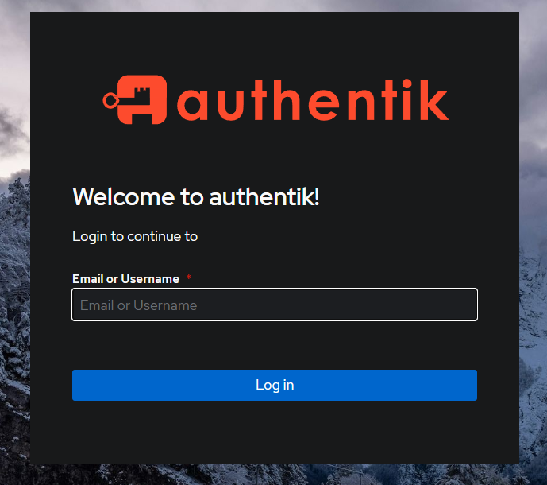

At this point, your VPS is set up and operational for normal hosting. Any future services should be connected to the Docker proxy network, and they can be referenced by their container names. For example, the VPS IP address can be replaced with `http://nginxproxymanager-npm-1:81`.

## Omada

Omada is a Software-Defined Networking (SDN) platform that can be self-hosted with Docker. It enables tighter integration between various network devices. In this use case, the router establishes a VPN connection into an isolated VLAN. The VLAN is then managed through Access Control List (ACL) policies, allowing us to expose only a single port on a single IP address. This least-privilege approach helps protect the VPS from potential compromises by limiting the attack surface between our home network and the VPS.

**Creating the VLAN**

Navigate to `https://[OmadaAddress]/#wiredNetworksLan`. Create new Lan with a unique VLAN ID like 60.

Navigate to `https://[OmadaAddress]/#VPN` and create a new **OpenVPN** profile. Ensure the profile has access to both the **main LAN** and the newly created VLAN. Additionally, define the **client address space** for the VPN.

From Network security -> Switch ACL, create Block all rules.

Create new IP port group that matches the vpn client adress space.

Create the acual block rule. Remember to do this both directions (inbound and outbound).

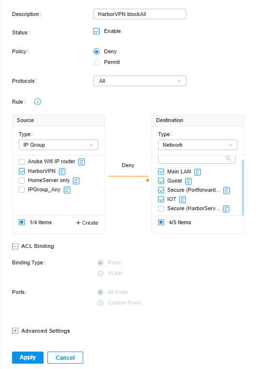

Create **permitting rules** by first creating an **IP-Port group** for your home server. For example, you can use `192.168.0.1:3001` to define the server's IP and port. Remember to permit inbound and outbound connections.

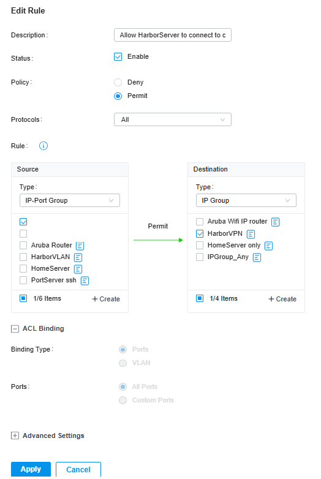

Through the **ordering system**, ensure the permitting rule for your home server (e.g., `192.168.0.1:3001`) has **higher priority** than the **Block All** rule.

Test the VPN profile by attempting to access other devices in your home network. All connections, except for `192.168.0.1:3001`, should fail, confirming the rule is working correctly.

## OpenVPN-forwarder

Instead of connecting the entire VPS to the VPN, we create two Docker containers: one acts as the **VPN client** , and the other as the **VPN forwarder** . This setup ensures that the **forwarder container's** address is mapped to your home server IP address. For example, `192.168.0.1:3001` would be forwarded to `http://vpn-forwarder:3001` within the Docker network.

Navigate to the `./VPNForwarder` directory. Copy and paste the `config.ovpn` file from Omada into the `vpn-config` folder. Next, open the `docker-compose.yml` file and replace the placeholder with the **home server IP address**.

```
  vpn-forwarder:
    image: alpine
    restart: unless-stopped
    container_name: vpn-forwarder
    cap_add:
      - NET_ADMIN
    command: >
      sh -c "
      apk add --no-cache iptables &&
      ip route add [home_server_ip] via 172.20.0.7 &&
      iptables -t nat -A PREROUTING -p tcp --dport 1:65535 -j DNAT --to-destination [home_server_ip] &&
      iptables -t nat -A POSTROUTING -j MASQUERADE &&
      tail -f /dev/null
      "
    networks:
      - reverseproxy_network
    depends_on:
      - openvpn-client

networks:
  reverseproxy_network:
    external: true
```

After this, any services allowed through the Omada ACL policies will be available at `vpn-forwarder:[port_number]`. These services can easily be used in **Nginx Proxy Manager**, as the VPN containers are part of the same Docker network. For new domains remember to add the new A records in CloudFlare.

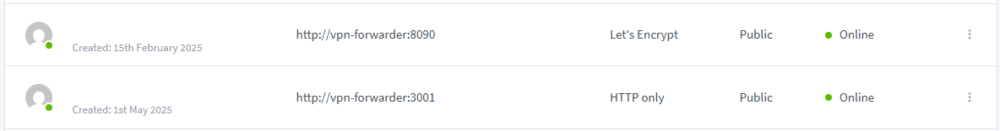

Documentation created with help from ChatGPT. Still a work in progress.
